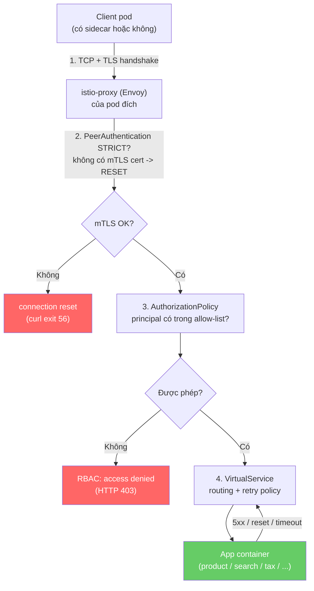

# Sơ đồ khái niệm ↔ manifest (tra cứu nhanh khi demo)

Một request đi qua mesh sẽ lần lượt chạm các lớp sau. Mỗi lớp gắn với 1 khái niệm,
1 file trong `k8s/istio/`, và 1 lệnh để tự kiểm chứng nó thực sự có hiệu lực.

## Bảng tra cứu

| # | Khái niệm | File cấu hình | Lệnh kiểm tra hiệu lực | Bằng chứng mong đợi |
|---|-----------|----------------|--------------------------|----------------------|
| 1 | Sidecar injection | (label namespace, không có file YAML riêng) | `kubectl get pods -n yas` | Mỗi pod `2/2` container |
| 2 | mTLS bắt buộc (PeerAuthentication) | [`mesh-security.yaml`](mesh-security.yaml) — `PeerAuthentication: STRICT` | `istioctl x describe svc product -n yas` | Output có dòng `PeerAuthentication STRICT` |
| 2 | mTLS phía gửi (DestinationRule) | [`mesh-security.yaml`](mesh-security.yaml) — `DestinationRule: ISTIO_MUTUAL` | `istioctl proxy-config secret deploy/product -n yas` | Cert `default` + `ROOTCA` trạng thái `ACTIVE` |
| 2 | Bằng chứng mTLS chặn plaintext | — | `kubectl exec plain-client -- curl http://product.yas/...` (pod ở `default`, không sidecar) | `curl exit 56` / "Connection reset by peer" |
| 3 | Định danh dịch vụ (SPIFFE identity) | `cluster.local/ns/yas/sa/<serviceaccount>` trong [`product-authorization.yaml`](product-authorization.yaml) | `kubectl get sa -n yas` | Tên SA khớp `fullnameOverride` từng chart (`cart`, `order`, `tax`, ...) |
| 3 | AuthorizationPolicy — allow-list cho `product` | [`product-authorization.yaml`](product-authorization.yaml) | `curl` từ pod `curl-denied` (default SA) vs pod với `serviceAccountName: cart` | Denied → `RBAC: access denied`/403; Allowed → không có chuỗi RBAC deny |
| 3 | AuthorizationPolicy — allow-list cho `search` | [`search-authorization.yaml`](search-authorization.yaml) | tương tự, target `search.yas:80` | tương tự |
| 4 | Retry policy (VirtualService) | [`tax-retry.yaml`](tax-retry.yaml) — `retries.attempts: 3, perTryTimeout: 2s` | `istioctl proxy-config routes deploy/order -n yas --name 80 -o json \| grep -A20 retryPolicy` | Thấy đúng `numRetries: 3` trong route config |
| 4 | Retry — bằng chứng runtime | — | `pilot-agent request GET stats \| grep upstream_rq_retry` trước/sau khi scale `tax` về 0 | Counter `upstream_rq_retry` tăng |
| 5 | Topology toàn cảnh | (không phải YAML, là quan sát bằng Kiali) | `istioctl dashboard kiali` → namespace `yas` → Graph (bật Traffic + Security) | Edge có icon khóa (mTLS), node `product`/`search` chỉ nhận traffic từ đúng allow-list |

## Cách dùng khi demo

1. Đi từ trên xuống dưới bảng — mỗi hàng là một "lát cắt" độc lập, không cần làm hết mới demo được hàng sau.
2. Nếu một bước fail, quay lại đúng cột "File cấu hình" của hàng đó để soát YAML, thay vì đoán ở toàn bộ `k8s/istio/`.
3. `test-plan.md` trong cùng thư mục là bản mở rộng của bảng này — có sẵn lệnh đầy đủ + chỗ paste log cho báo cáo.
